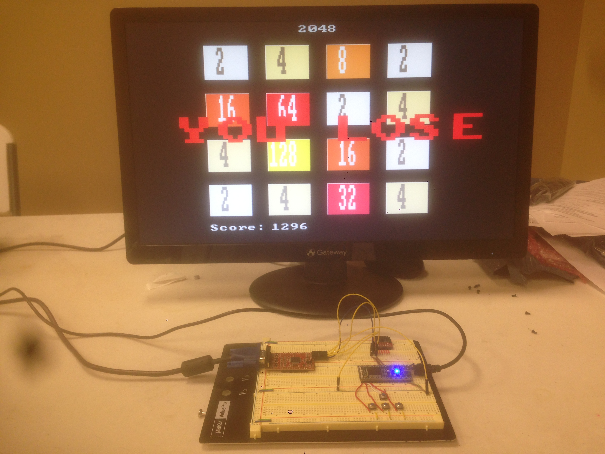

# mbed-2048
2048 game on mbed LPC1768 using a UVGAII serial connection. The program starts with the game ready to play. Player uses 4 push buttons to direct the tiles in the desired direction: UP, DOWN, LEFT or RIGHT. The goal is to combine the numbers and get to the 2048 tile! The game ends when the player is either stuck (no possible moves in any direction) or if the 2048 tile is reached. To restart the game, player must press the reset button on the mbed.

###Components
- mbed LPC1768
- uVGAII
- Push buttons

### Demo
https://www.youtube.com/watch?v=gd_Ts53VWp0

More at https://developer.mbed.org/users/reinaldo422/notebook/2048-mbed-game-using-uvgaii/
